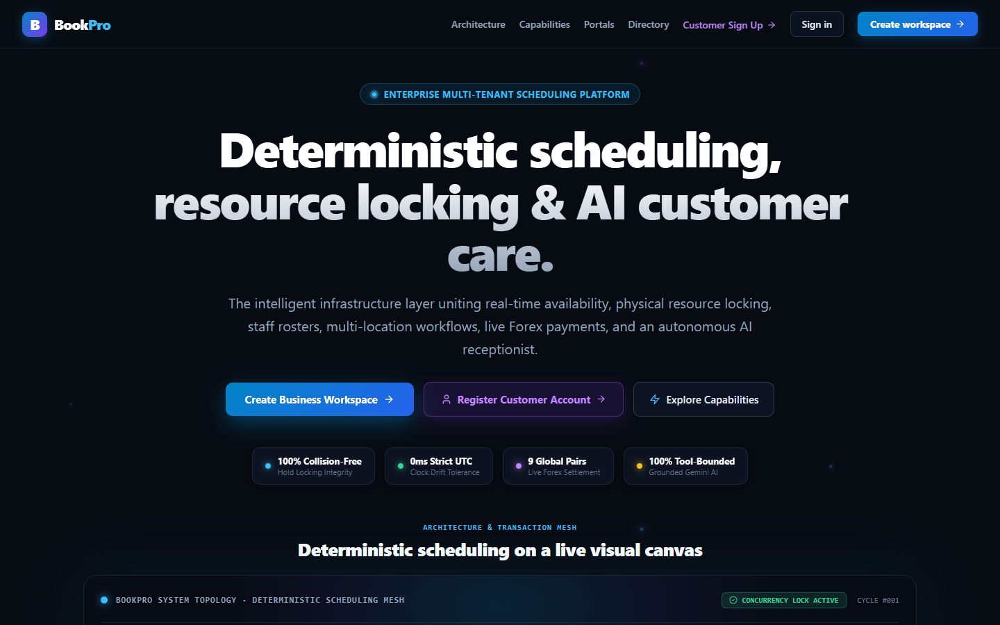
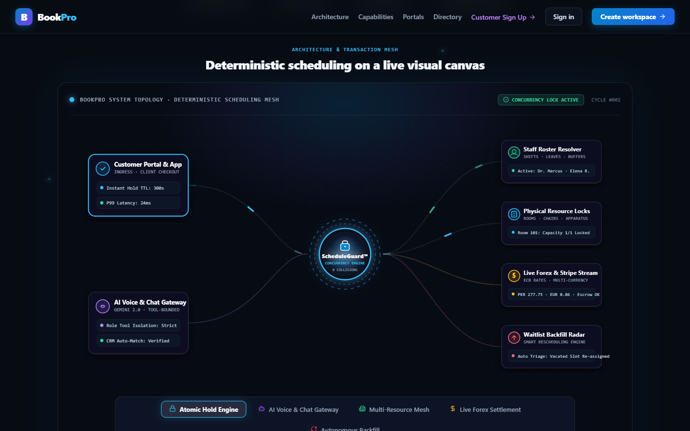
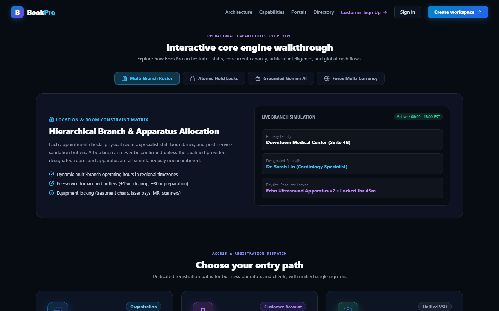
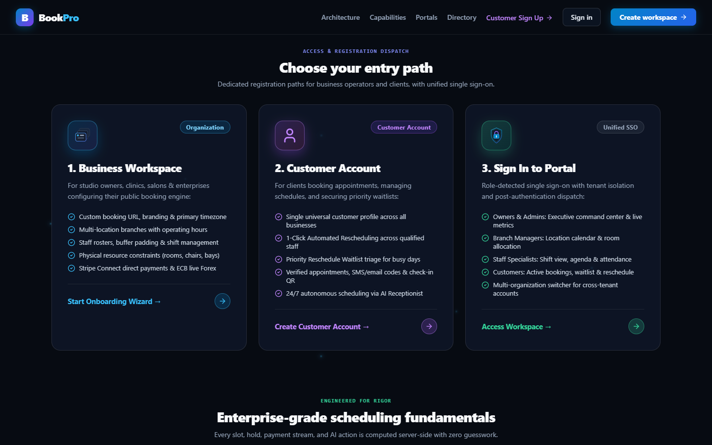

# BookPro

BookPro is a multi-tenant appointment scheduling platform for service businesses. Customers book services online, while business owners and staff manage locations, availability, appointments, payments, and daily operations.

[**Open the live demo**](https://bookpro-fawn.vercel.app)



*The deployed public experience introduces BookPro’s booking, scheduling, and AI-assisted workflows.*

## Features

- Public service booking with location, staff, availability, customer details, and checkout.
- Server-calculated availability that considers operating hours, staff schedules and leave, service buffers, resources, capacity, and existing appointments.
- Persisted booking holds, idempotent operations, and PostgreSQL schedule guards for concurrent booking changes.
- Customer and business workspaces with appointment management, customer records, waitlists, attendance, QR check-in, reviews, commissions, and analytics.
- Stripe payment intents, webhook processing, refunds, and organization-level reporting currencies.
- Authenticated tenant-scoped server-sent events for schedule updates.
- Google Calendar synchronization and queued email/SMS notifications through the background worker.
- Gemini-powered customer and business assistance mediated by application tools and validated inputs.

Feature availability depends on provider configuration. External credentials are not included.

## Technology

| Area | Stack |
| --- | --- |
| Web | Next.js 14, React 18, TypeScript, TanStack Query, React Hook Form, Zod, Framer Motion |
| API | NestJS 10, TypeScript, Prisma 5 |
| Data and jobs | PostgreSQL 16, Redis 7, BullMQ |
| Monorepo | pnpm 8, Turborepo |
| Integrations | Stripe, Google Calendar, Gemini, Brevo email, Twilio SMS |
| Quality | Jest, Playwright, GitHub Actions |
| Hosting | Vercel configuration for the web app and API; Docker Compose for local PostgreSQL and Redis |

Versions reflect package declarations and local infrastructure configuration. See workspace manifests and the lockfile for exact dependency resolution.

## Architecture

The Next.js app calls a NestJS API. Prisma persists tenant and scheduling data in PostgreSQL. Redis supports caching, queues, and realtime event delivery; a separate NestJS worker processes queued notifications, calendar synchronization, and maintenance tasks.

See the [architecture guide](docs/ARCHITECTURE.md) for request flow, booking lifecycle, authorization boundaries, and integrations.

## Repository layout

```text
apps/web       Next.js customer and business interfaces
apps/api       NestJS HTTP API and domain modules
apps/worker    NestJS background processing
packages/      Shared contracts, validation, configuration, UI, and server utilities
prisma/        PostgreSQL schema and migrations
infra/         Local PostgreSQL and Redis services
```

Jest suites live beside API and worker modules; the Playwright smoke test lives under `apps/web/e2e/`.

## Security model

The API applies authentication, explicit permission classification, organization matching, location scope checks, request validation, and rate limiting. Session cookies are HTTP-only and secure in production. Provider credentials are server-side configuration and are excluded from the repository; review `.env.example` before enabling integrations.

## Local development

Prerequisites: Node.js 20 or newer, pnpm 8.15.4, and Docker with Docker Compose.

```bash
pnpm install --frozen-lockfile
```

Copy `.env.example` to `.env` and replace the development security placeholders with unique local values. Configure optional provider credentials only when using those integrations. The example PostgreSQL URL matches the local Docker Compose service.

```bash
pnpm infra:up
pnpm db:generate
pnpm db:migrate
pnpm dev
```

The development command starts the web app, API, and worker. The root `db:seed` script refers to a seed file that is not present, so database seeding is not included here.

## Checks

```bash
pnpm typecheck
pnpm lint
pnpm test
pnpm --filter @bookpro/web test:e2e
pnpm build
```

The API and worker have Jest suites, and the web app has a Playwright smoke test. Some API scenarios mock persistence. No API integration suite is currently tracked in the repository; the existing `test:integration` script points to an untracked configuration file and is not run in CI.

The API and worker unit suites and web smoke test pass in the current portfolio snapshot. `pnpm typecheck` and `pnpm build` also complete. Lint is not ready: several workspaces have no ESLint configuration, and the web configuration references `eslint-config-next`, which is not installed. The CI workflow currently invokes lint and will need this configuration gap fixed before it can pass end to end.

## Deployment

The repository includes Vercel configuration for the web app and API, Dockerfiles for the API and worker, and a GitHub Actions CI workflow. The live demo is hosted at Vercel. Provider credentials and production infrastructure are managed outside this repository.

## Product tour

These are real captures of the deployed public experience. The deployment currently has no public business data or demo account, so authenticated workspace screens are not represented.








## Project status

BookPro is a completed portfolio project with ongoing maintenance and refinement. The live deployment demonstrates the public product experience; provider integrations and authenticated workspace screens require suitable configured credentials and demo data.

## Roadmap

- Expand repeatable end-to-end coverage of customer booking and business scheduling.
- Document provider setup and local demo data workflows.
- Continue hardening deployment and operational observability.

## License

No license file is currently included. Contact the repository owner before reusing or distributing the project.
