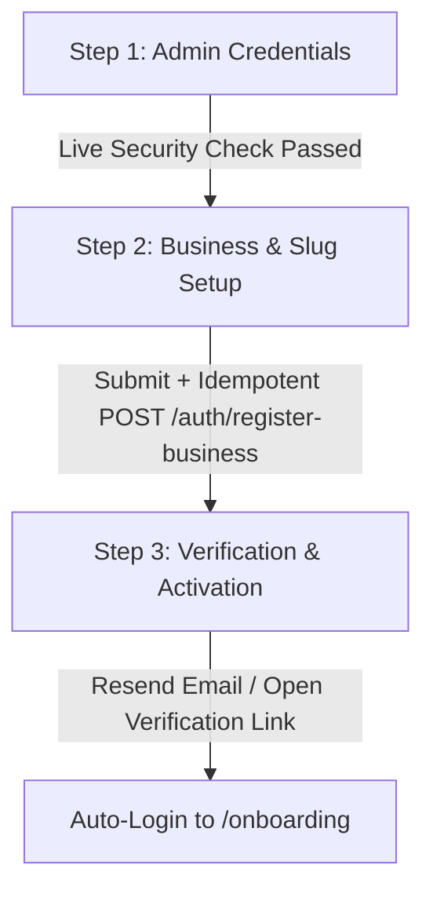

# BookPro Design System & Registration Flow Specification
<!-- Hallmark · genre: modern-minimal · theme: Midnight · macrostructure: Multi-Stage Studio · version: 1.2.0 -->

## 1. System Philosophy & Aesthetic Anchor

BookPro adheres to the **Hallmark Modern-Minimal Midnight** aesthetic discipline:
- **Anti-AI-Slop Principle**: Every screen feels intentionally crafted, structural, tactile, and restrained. Zero generic purple gradient blobs, zero fake browser dots, zero fabricated metrics.
- **Palette Band**: Dark Midnight (`oklch(14% 0.02 260)` base paper) with multi-layered OKLCH glassmorphism (`backdrop-filter: blur(20px)`), hairline translucent borders (`rgba(255, 255, 255, 0.08)` to `0.14`), and vibrant cyan/electric-blue primary accents (`#0284c7` / `#38bdf8`).
- **Typography**: Clean Roman display headings (never italic display headers), high-contrast labels, legible monospace metadata tokens (`JetBrains Mono` / `ui-monospace`).
- **Micro-Interactions**: Interactive 3D cursor-tracking card tilt with dynamic radial spotlight gradients, subtle floating particle depth, and responsive 8-state interactive elements.

---

## 2. Token Architecture

```css
:root {
  /* Surface Tokens (OKLCH Midnight) */
  --bp-bg-canvas: oklch(12% 0.02 260);
  --bp-bg-surface: rgba(15, 23, 42, 0.75);
  --bp-bg-surface-elevated: rgba(30, 41, 59, 0.65);
  --bp-bg-input: rgba(15, 23, 42, 0.85);

  /* Border & Glass Tokens */
  --bp-border-subtle: rgba(255, 255, 255, 0.08);
  --bp-border-strong: rgba(255, 255, 255, 0.16);
  --bp-border-focus: #38bdf8;
  --bp-glass-blur: blur(20px);

  /* Accent & Status Tokens */
  --bp-accent-primary: #0284c7;
  --bp-accent-glow: rgba(2, 132, 199, 0.35);
  --bp-accent-hover: #0369a1;
  --bp-accent-cyan: #38bdf8;
  --bp-success: #10b981;
  --bp-success-glow: rgba(16, 185, 129, 0.25);
  --bp-warning: #f59e0b;
  --bp-error: #f43f5e;
  --bp-error-glow: rgba(244, 63, 94, 0.25);

  /* Typography Colors */
  --bp-text-primary: #f8fafc;
  --bp-text-secondary: #cbd5e1;
  --bp-text-muted: #94a3b8;
  --bp-text-dim: #64748b;
}
```

---

## 3. Upgraded Registration Architecture

### 3.1 Three-Stage Progressive Disclosure Flow



#### **Stage 1: Administrator Credentials & Password Security Engine**
- **Fields**: Full Name, Work Email, Master Password, Password Confirmation.
- **Real-Time Password Security Engine**:
  1. *Dynamic Strength Metric*: Evaluates entropy, character diversity, length, and common patterns (Score: 0 to 4 $\to$ Weak, Fair, Good, Strong).
  2. *Live Criteria Checklist*:
     - `[x]` Minimum 12 characters (or 8+ with high complexity)
     - `[x]` Contains uppercase letter (`A-Z`)
     - `[x]` Contains lowercase letter (`a-z`)
     - `[x]` Contains number (`0-9`)
     - `[x]` Contains special character (`!@#$%^&*...`)
     - `[x]` Password confirmation matches
  3. *Visual Indicator*: 4-bar dynamic color strength meter + real-time validation badges.
  4. *Interaction*: Password visibility toggle (Show/Hide).

#### **Stage 2: Organization Identity & Booking URL Slug**
- **Fields**: Business Legal Name, Public Booking URL Slug, Primary Timezone (IANA validated), Billing Currency.
- **Live Slug Availability Engine**: Debounced check against `GET /auth/registration/slug-availability?slug={slug}` with live feedback pill (`bookpro.app/{slug}`).

#### **Stage 3: Email Verification & Resend Gateway**
- **Durable Registration**: Creates user, organization, owner membership, and 24h verification token.
- **Resend Email Integration**:
  - Direct delivery via Resend API when `RESEND_API_KEY` is configured.
  - Automatic fallback to default verified sender `onboarding@resend.dev` if custom domain is not yet configured.
  - Asynchronous dispatch through PostgreSQL `outbox_events` and worker notification engine.
  - Development mode verification link logging & instant preview helper.
  - "Resend Verification Email" button with 60-second countdown rate-limit timer.

---

## 4. State & Microinteraction Discipline (8 Mandatory States)

Every interactive control implements all 8 mandatory states:
1. **Default**: Translucent dark glass backdrop, subtle border.
2. **Hover**: Border luminesces, subtle background lighten (`+4% L`).
3. **Focus-Visible**: 2px cyan highlight ring with `outline-offset: 2px`.
4. **Active**: 1px downward tactile depression (`transform: translateY(1px)`).
5. **Disabled**: `opacity: 0.5`, `cursor: not-allowed`, no hover transformation.
6. **Loading**: Kinetic spinner / pulse animation with disabled inputs.
7. **Error**: Rose border (`#f43f5e`), red alert text, aria-invalid attributes.
8. **Success**: Emerald border (`#10b981`), checkmark icon, positive validation confirmation.
