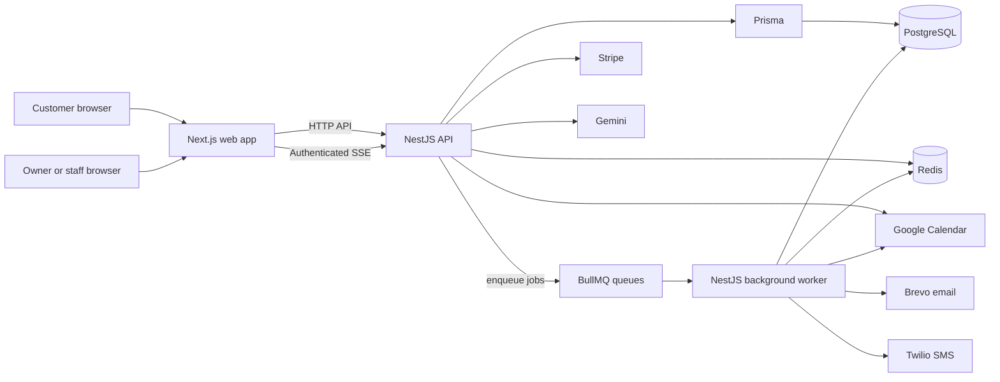
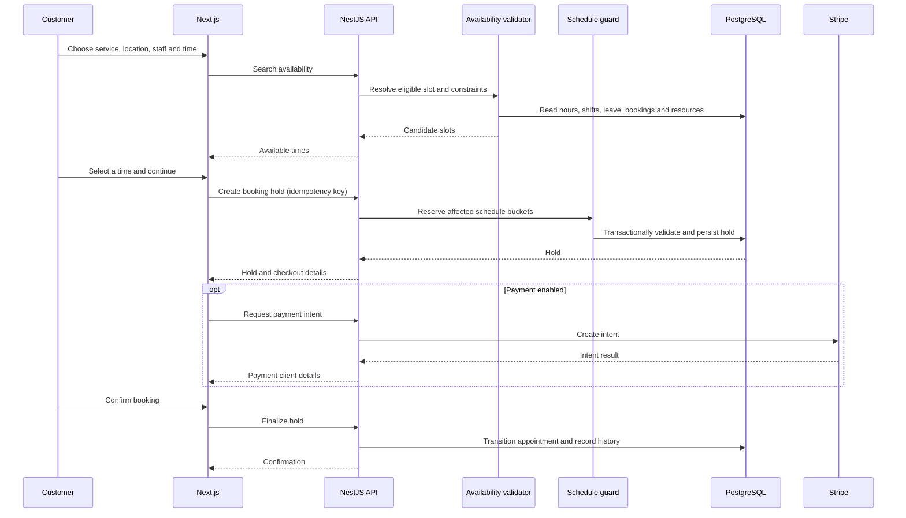

# BookPro architecture

BookPro is a pnpm/Turborepo monorepo. The web app presents public booking and authenticated customer/business workspaces. A NestJS API owns domain operations and persists data through Prisma. PostgreSQL is the authoritative store; Redis is used for caching, queue transport, and realtime event fan-out. A separate NestJS worker handles asynchronous work.

## System overview

Integrations are configuration-dependent. Stripe can be disabled; email and SMS providers can be disabled; Gemini and Google Calendar require their respective server-side configuration.

## Tenant and access boundaries

Organizations own locations, services, staff memberships, resources, schedules, appointments, customers, and operational records. Organization identifiers are resolved from authenticated session context and request routing. Central guards enforce authentication, explicit route classification, permission requirements, organization matching, and (for location-scoped memberships) location access. Public endpoints are explicitly marked. The realtime endpoint additionally checks that the requested organization matches the authenticated context.

Authentication uses signed access tokens and persisted sessions, with refresh-token lifecycle management. The API accepts bearer tokens or the `access_token` cookie; the controller sets HTTP-only cookies and marks them secure in production. Authorization is expressed through role-derived permission keys and a deny-by-default permission guard.

## Availability and booking lifecycle

Availability queries validate dates and inputs, load the organization-scoped location and service, resolve eligible staff, apply local operating windows and staff availability, and account for appointment busy intervals, duration/buffers, resource constraints, and service capacity. Results may be cached in Redis with tenant-aware keys. Dates are computed against location timezones and stored as instants.

Booking holds are persisted in PostgreSQL. The authoritative availability validator checks current availability as part of reserving a slot, and the schedule guard uses organization-scoped staff, resource, and capacity date buckets to serialize conflicts. Idempotency protects supported booking operations from duplicate requests. Appointment service transitions are checked against an explicit lifecycle map, including confirmation, check-in, in-progress, completion, cancellation, and no-show states.

Payment is provider-adapted. Stripe payment intents carry organization/hold/appointment metadata; webhook events are verified and recorded for processing. Refunds and commission accounting are implemented in domain modules. Provider calls are conditional on configuration and external account readiness.

## Background processing and realtime

The API emits queued work through BullMQ and the worker consumes it. The worker includes an outbox dispatcher, hold/waitlist/idempotency/appointment/optimizer janitors, notification delivery, and inbound/outbound calendar synchronization. Persisted outbox events support retryable notification processing.

The API exposes authenticated server-sent events. Redis Pub/Sub carries tenant-scoped event streams to connected clients; the SSE stream includes connection/reconnection metadata and heartbeat events. Clients can refetch canonical state after reconnecting.

## Analytics and AI

Analytics endpoints aggregate organization and operational metrics from stored records and payment data. The schema also includes daily organization, staff, and service metric models. Analytics are not a separate event-stream warehouse pipeline.

The AI module uses Gemini through a provider adapter. Conversations are grounded through application-owned tools backed by availability, booking, customer, waitlist, payment, and business services. Tool inputs use shared validation schemas, and the assistant receives a trusted organization, actor, permission, and location context. AI code does not issue direct model-authored SQL.

## Shared packages and deployment

- `packages/contracts` holds shared request, response, permission, and event types.
- `packages/validation` defines shared Zod schemas.
- `packages/server-core` contains request context, authorization and location guards, Redis support, time primitives, and other API/worker utilities.
- `packages/config` loads and validates server configuration.
- `packages/ui` contains shared web UI; `packages/observability` contains health and observability helpers; `packages/test-utils` contains test doubles and harnesses.
- `prisma/` contains the schema and database migrations.
- `infra/docker-compose.yml` starts local PostgreSQL and Redis.

Vercel configuration exists for the web app and API. Dockerfiles exist for the API and worker. GitHub Actions runs repository validation; deployment secrets and production infrastructure are managed outside the repository.
